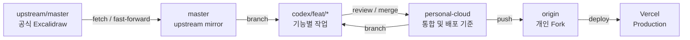
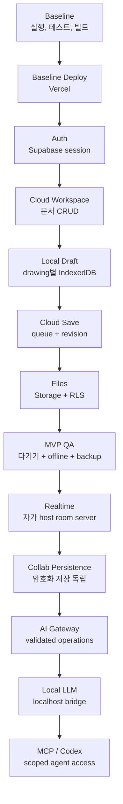
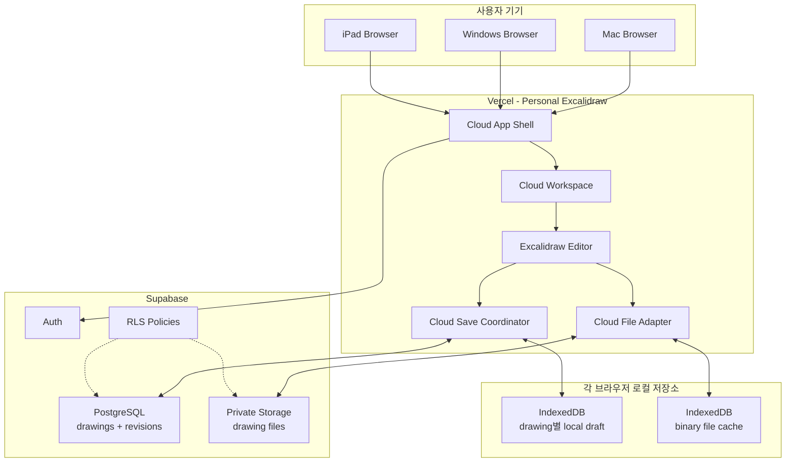
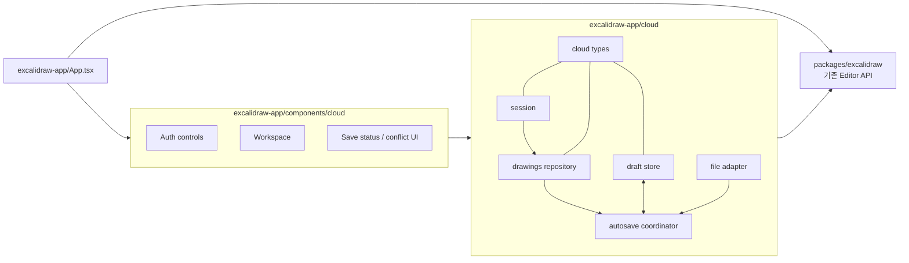
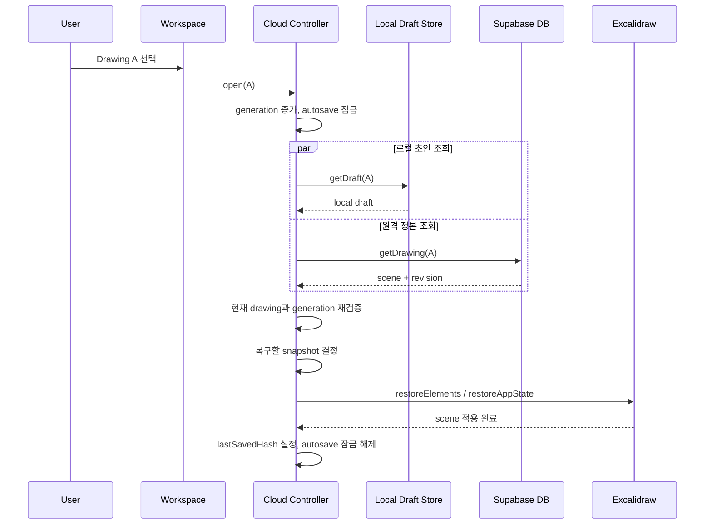
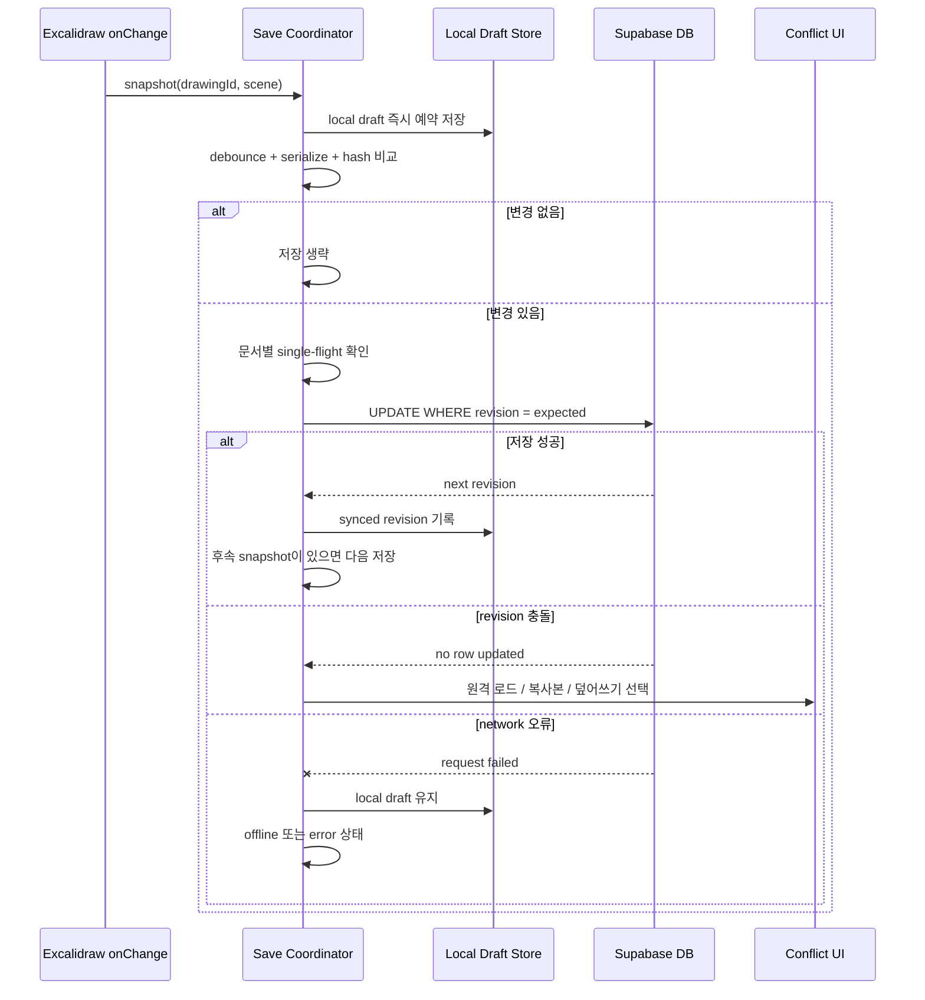
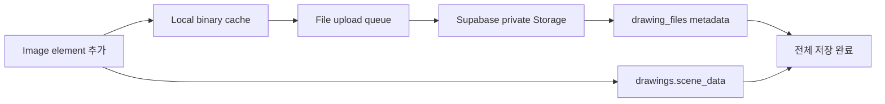
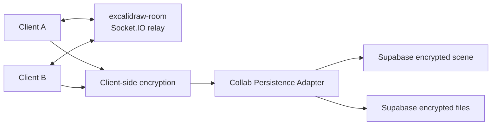
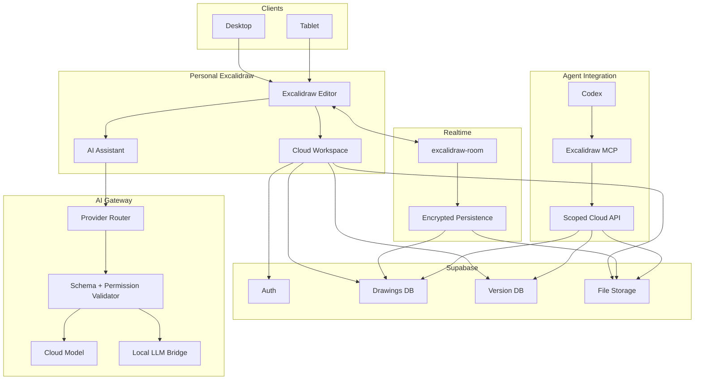
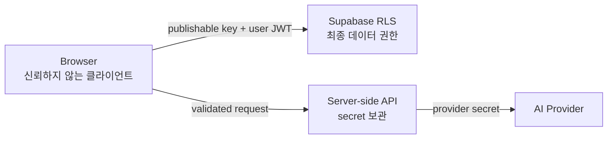

# Personal Excalidraw Cloud 아키텍처

이 문서는 개발 흐름과 런타임 구조를 함께 설명한다. 구현이 변경되면 코드와 같은
작업에서 이 문서를 갱신한다.

## 1. 개발 브랜치 흐름

`master`는 공식 저장소와 동일한 상태를 유지하고 개인 기능은 통합 브랜치와 기능
브랜치에서 관리한다.

초기 `personal-cloud`가 아직 없을 때 만든 기능 브랜치는 `master`에서 시작할 수 있다.
이후에는 `personal-cloud`에서 기능 브랜치를 만들고 완료 후 다시 통합한다.

## 2. 전체 구현 흐름

각 단계는 앞 단계의 데이터 안전성과 운영 기반을 전제로 한다.

## 3. MVP 런타임 아키텍처

MVP는 로그인, 문서 목록, 문서별 로컬 초안, Cloud Save, 이미지 복원과 여러 기기
동기화까지다. 편집기는 기존 Excalidraw를 그대로 사용한다.

### 책임 구분

| 영역 | 책임 | 책임지지 않는 것 |
| --- | --- | --- |
| Excalidraw Editor | scene 편집, history, export | 계정, 문서 목록, DB revision |
| Cloud App Shell | auth/session, 현재 drawing 선택 | element 내부 로직 |
| Cloud Save Coordinator | debounce, queue, revision, 충돌 | binary upload |
| Cloud File Adapter | binary upload/download와 상태 | scene revision |
| Local Draft Store | offline 복구와 미저장 snapshot | 서버의 정본 판정 |
| Supabase | 사용자별 영속 저장과 RLS | 브라우저 secret 보관 |

## 4. 앱 내부 모듈 경계

개인 기능은 우선 `excalidraw-app` 안의 adapter로 격리한다.

Cloud module이 core의 private 구현을 직접 import하지 않게 한다. 공개 API가 부족하면
먼저 adapter로 해결하고, 그래도 불가능할 때만 core API 확장을 검토한다.

## 5. Cloud Drawing 열기

서버 응답이 늦게 도착해 다른 문서를 덮어쓰지 않도록 drawing ID와 operation generation을
검증한다.

사용자가 A 로딩 중 B를 선택하면 A의 늦은 응답은 버리고 B만 적용한다.

## 6. Autosave와 Revision 충돌

`onChange`는 네트워크를 직접 호출하지 않고 최신 snapshot만 coordinator에 전달한다.

## 7. 파일 저장 흐름

scene과 파일 저장은 별도 상태지만 사용자에게 하나의 저장 상태로 조합해 보여준다.

파일 업로드가 끝나지 않았으면 scene 저장만 성공해도 전체 상태를 `saved`로 표시하지 않는다.
version history가 참조할 수 있으므로 파일 삭제는 즉시 실행하지 않고 orphan 유예 기간을 둔다.

## 8. 공동편집 확장 구조

MVP에서는 Cloud Save와 Live Collaboration을 분리한다. 자체 Socket 서버를 붙인 뒤
persistence를 별도 단계로 이전한다.

일반 Cloud Drawing의 revision 저장과 collab room persistence를 자동으로 합치지 않는다.
room 결과를 Cloud Drawing으로 확정하는 소유권과 시점은 별도 설계가 필요하다.

## 9. 최종 목표 아키텍처

AI와 agent는 저장 기반과 version history가 안정된 뒤 추가한다.

## 10. 신뢰 경계

- 브라우저가 전달하는 `owner_id`, role, storage path를 신뢰하지 않는다.
- publishable key 노출은 정상이며 데이터 보호는 RLS가 담당한다.
- service role과 AI provider key는 server-side에만 둔다.
- AI/MCP operation은 대상 drawing 권한과 element 소속을 다시 검증한다.
